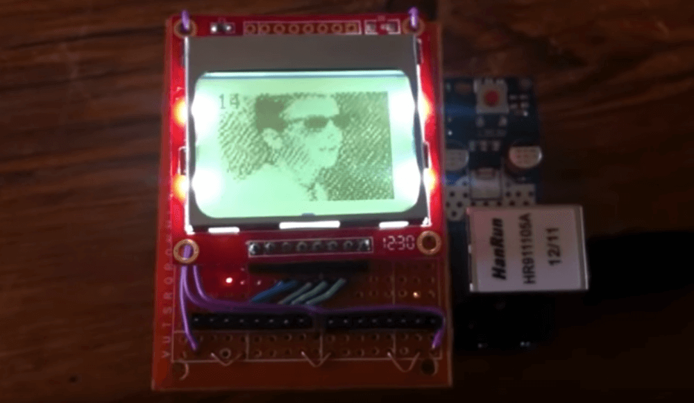

# Processing video encoder for Arduino Nokia 3310 video player

Processing sketches that convert videos into a custom format to be displayed on a Nokia 3310 LCD via Arduino + SD card.

## [YouTube demo](https://www.youtube.com/watch?v=FJBNF5x1_kA)

## Dependencies

* Processing 1.5.1 was used, changes will be required for compatibility with Processing 2+.

## Usage

Please read the [full writeup](https://joeraut.com/blog/playing-video-nokia-3310/) on how to get things working.

See the [Arduino sketch for playback](https://github.com/joeraut/arduino-nokia3310-video-player) of the generated video files.

## Notes

Two sketches are provided:

* `Video_Encoder_3D_Cube.pde` converts a `.mov` format video file (default `data.mov`) into the custom video file format (`data.dat`)
* `Video_Encoder_3D_Cube` renders a rotating 3D cube and exports it into the custom video file format (`data.dat`)

## License

This project is licensed under the MIT License - see the [LICENSE](LICENSE) file for details.
